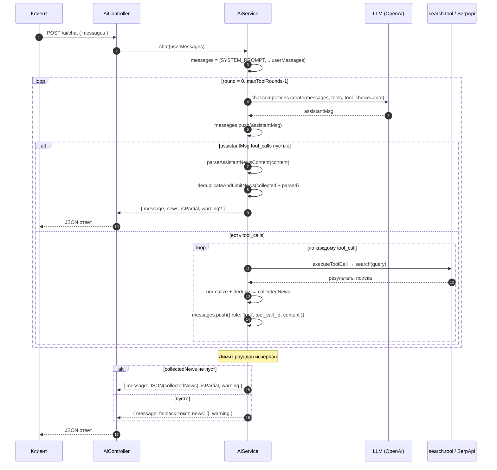
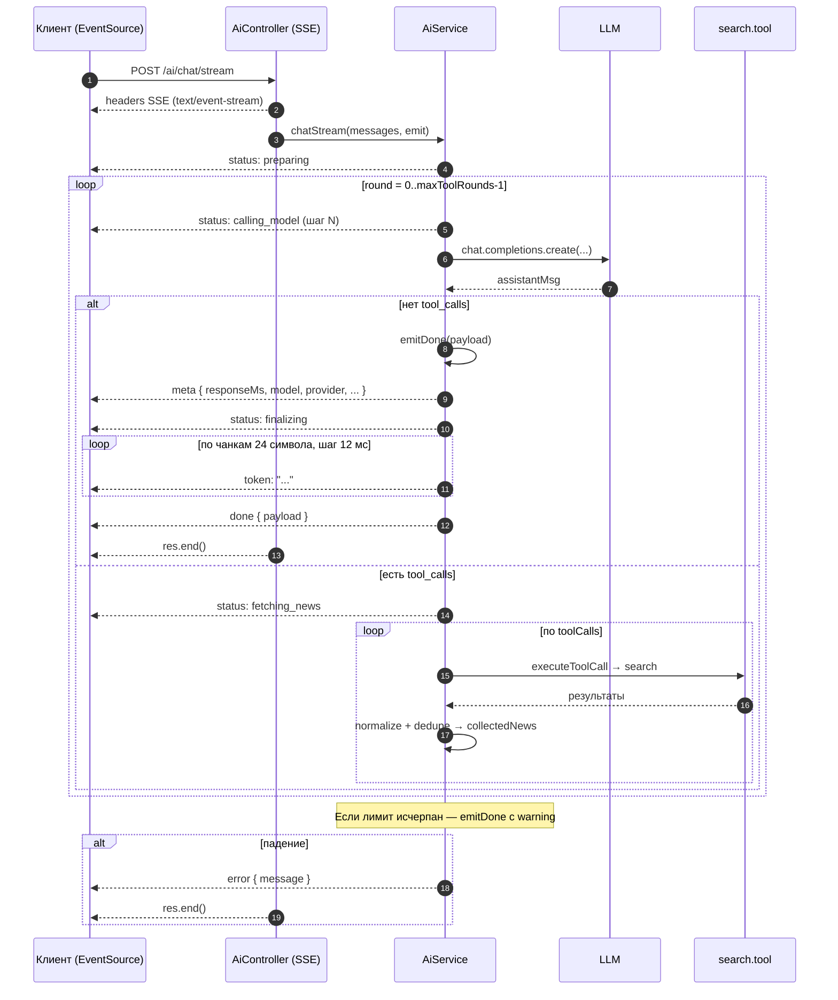
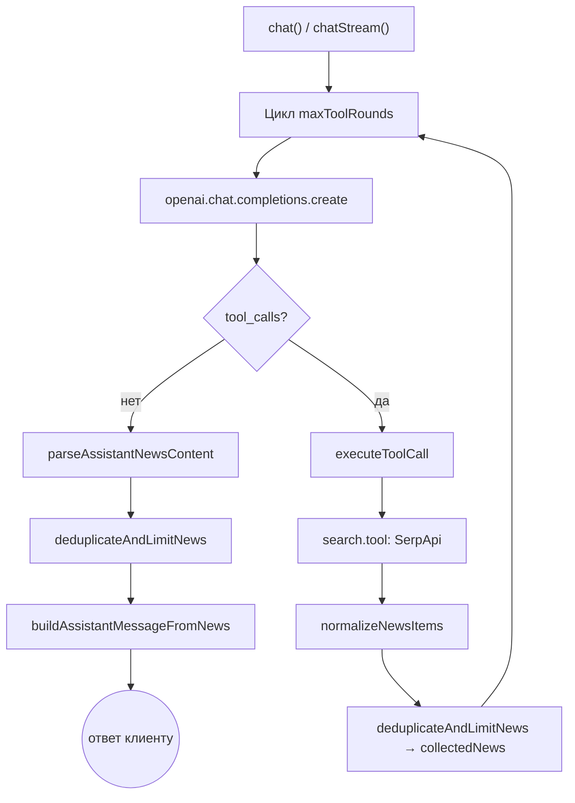

# `AiService` — интеграция с LLM и tool-calling

**Файл:** [`backend/src/ai/ai.service.ts`](../../backend/src/ai/ai.service.ts)

## 1. Что делает сервис

`AiService` — это NestJS-сервис, который инкапсулирует общение с
LLM (OpenAI или любой OpenAI-совместимый провайдер) для решения одной
прикладной задачи: **собрать ровно 10 актуальных новостей по запросу
пользователя и вернуть их клиенту в строго структурированном виде**
(JSON-массив с полями `title`, `source`, `date`, `snippet`, `link`).

Сервис умеет:

1. Делать обычный запрос/ответ (`chat`) — синхронный REST-обмен.
2. Стримить промежуточные статусы и токены ответа (`chatStream`) —
   через Server-Sent Events на стороне контроллера.
3. Использовать **OpenAI function calling** (`tool_choice: 'auto'`)
   с инструментом `search`, чтобы модель сама решала, когда ей нужно
   сходить в интернет за свежими данными (SerpApi → Google News).
4. Накапливать и дедуплицировать новости между несколькими раундами
   tool-вызовов и собирать финальный ответ даже при частичном результате.

## 2. Почему так сделано

### 2.1. Зачем tool-calling, а не «всё в одном промпте»

LLM-модели не имеют доступа к свежим данным. Чтобы выдавать
актуальные новости, модель должна вызывать внешний поиск.
OpenAI function calling — стандартный способ это сделать: модель сама
формирует поисковые запросы, мы их исполняем и возвращаем ей результат,
а она агрегирует. Такой подход:

- избавляет от хрупкого парсинга «модель попросила поискать вот так»
  из свободного текста;
- даёт модели возможность уточнять запрос несколько раз подряд
  (например, расширять формулировку, если новостей мало).

### 2.2. Зачем цикл `maxToolRounds`

Одного вызова `search` редко достаточно: SerpApi отдаёт до 5 новостей
за запрос, а цель — 10 уникальных. Поэтому сервис запускает цикл
до `maxToolRounds = 5` итераций, в каждой из которых модель может
запросить ещё один поиск. Жёсткий лимит защищает от бесконечной
цепочки tool-вызовов и контролирует стоимость.

### 2.3. Зачем нормализация и дедупликация

Модель и SerpApi могут вернуть мусорные/неполные записи (без ссылки,
с пустым заголовком и т. п.). Поэтому есть два защитных слоя:

- `normalizeNewsItems` — приводит каждую запись к единому виду,
  заполняет дефолты, обрезает `snippet` до `maxSnippetLength = 320`,
  отбрасывает записи без `link`.
- `deduplicateAndLimitNews` — убирает дубли по ссылке (или по
  составному ключу `title|source|date`, если ссылки нет) и режет
  список до `targetNewsCount = 10`.

### 2.4. Зачем «частичный» ответ

Если за допустимое число раундов набрать 10 новостей не получилось,
сервис всё равно возвращает то, что собрал, с флагом `isPartial: true`
и предупреждением `warning`. Пользователь увидит хоть что-то, а
фронтенд сможет показать пометку «показаны N из 10».

### 2.5. Зачем отдельный `chatStream`

Сбор новостей через tool-calling может занимать несколько секунд.
Чтобы UI не выглядел «зависшим», сервис эмитит события:

- `status` — этап работы (`preparing`, `calling_model`,
  `fetching_news`, `synthesizing`, `finalizing`);
- `meta` — мета-информация (время ответа, модель, провайдер,
  количество новостей);
- `token` — текст финального сообщения, нарезанный кусками по 24
  символа с задержкой 12 мс (искусственный typewriter-эффект для UX);
- `done` — финальный payload, идентичный ответу `chat`;
- `error` — единый формат ошибки.

Состояния `AiStatusStage` и формат событий описаны в
[`dto/chat.dto.ts`](../../backend/src/ai/dto/chat.dto.ts).

## 3. Архитектура и зависимости

```mermaid
flowchart LR
    Client["Клиент (фронтенд)"] -->|POST /ai/chat| Controller["AiController"]
    Client -->|POST /ai/chat/stream\n(SSE)| Controller
    Controller --> Service["AiService"]
    Service -->|chat.completions.create| OpenAI["OpenAI SDK\n(LLM_BASE_URL опционально)"]
    Service -->|search(query)| SearchTool["search.tool.ts"]
    SearchTool -->|GET /search.json| SerpApi["SerpApi\n(Google News)"]
    Service -.->|SYSTEM_PROMPT| Prompt["prompts/system.prompt.ts"]
    Service -.->|tools schema| Tools["tools/search.tool.ts"]
```

Ключевые сущности:

| Сущность | Назначение |
| --- | --- |
| `AiService` | Оркестрация диалога с моделью и tool-вызовов. |
| `AiController` | HTTP-входы `POST /ai/chat` и `POST /ai/chat/stream`. |
| `SYSTEM_PROMPT` | Жёсткие правила формата вывода (строгий JSON-массив из 10 элементов). |
| `search` | Реальный поиск в SerpApi (Google News). |
| `tools` | Схема функции `search` для OpenAI function calling. |
| `ChatStreamEvent` | Дискриминированный union для SSE-событий. |

### 3.1. Конфигурация через переменные окружения

| Переменная | Значение по умолчанию | Назначение |
| --- | --- | --- |
| `LLM_MODEL` | `gpt-4.1-mini` | Идентификатор модели. |
| `LLM_API_KEY` / `OPENAI_API_KEY` | — | Ключ доступа к LLM. |
| `LLM_BASE_URL` | не задан → OpenAI | Кастомный OpenAI-совместимый endpoint. Если задан — `providerName = 'local-openai-compatible'`. |
| `SERP_API_KEY` | — | Ключ доступа к SerpApi для инструмента `search`. |

### 3.2. Константы класса

```24:42:backend/src/ai/ai.service.ts
  private readonly model = process.env.LLM_MODEL ?? 'gpt-4.1-mini';

  private readonly openai = new OpenAI({
    apiKey: process.env.LLM_API_KEY ?? process.env.OPENAI_API_KEY,
    ...(process.env.LLM_BASE_URL && { baseURL: process.env.LLM_BASE_URL }),
  });

  private readonly targetNewsCount = 10;

  private readonly maxToolRounds = 5;

  private readonly maxSnippetLength = 320;

  private readonly fallbackWarning =
    'Не удалось собрать полный список новостей в пределах лимита tool-вызовов.';

  private readonly providerName = process.env.LLM_BASE_URL
    ? 'local-openai-compatible'
    : 'openai';
```

## 4. Последовательность выполнения

### 4.1. Обычный режим — `chat()`



Ключевые точки кода обычного режима:

- Вход метода и формирование `messages`:

```201:209:backend/src/ai/ai.service.ts
  async chat(userMessages: { role: string; content: string }[]) {
    const messages: OpenAI.Chat.ChatCompletionMessageParam[] = [
      { role: 'system', content: SYSTEM_PROMPT },
      ...userMessages,
    ] as OpenAI.Chat.ChatCompletionMessageParam[];

    this.logger.log(
      `Using model: ${this.model}, baseURL: ${process.env.LLM_BASE_URL ?? 'OpenAI default'}`,
    );
```

- Основной цикл tool-calling:

```214:223:backend/src/ai/ai.service.ts
      for (let round = 0; round < this.maxToolRounds; round += 1) {
        const completion = await this.openai.chat.completions.create({
          model: this.model,
          messages,
          tools: tools as OpenAI.Chat.ChatCompletionTool[],
          tool_choice: 'auto',
        });

        const assistantMsg = completion.choices[0].message;
        messages.push(assistantMsg);
```

- Условие выхода из цикла и сборка финального ответа:

```225:250:backend/src/ai/ai.service.ts
        if (!assistantMsg.tool_calls?.length) {
          const assistantNews = this.parseAssistantNewsContent(
            assistantMsg.content,
          );
          const mergedNews = this.deduplicateAndLimitNews([
            ...collectedNews,
            ...assistantNews,
          ]);
          const hasStructuredNews = mergedNews.length > 0;
          const isPartial =
            hasStructuredNews && mergedNews.length < this.targetNewsCount;

          return {
            message: {
              role: assistantMsg.role ?? 'assistant',
              content: hasStructuredNews
                ? this.buildAssistantMessageFromNews(mergedNews)
                : (assistantMsg.content ?? ''),
            },
            news: hasStructuredNews ? mergedNews : undefined,
            isPartial,
            warning: isPartial
              ? `Показаны ${mergedNews.length} из ${this.targetNewsCount} новостей.`
              : undefined,
          };
        }
```

- Обработка tool-calls (поиск + нормализация + накопление):

```252:271:backend/src/ai/ai.service.ts
        for (const toolCall of assistantMsg.tool_calls) {
          const toolResult = await this.executeToolCall(toolCall);
          try {
            const parsedToolContent = JSON.parse(toolResult.content) as string;
            const normalized = this.normalizeNewsItems(parsedToolContent);
            if (normalized.length > 0) {
              collectedNews = this.deduplicateAndLimitNews([
                ...collectedNews,
                ...normalized,
              ]);
            }
          } catch {
            // no-op: tool might return an error payload, keep going
          }
          messages.push({
            role: 'tool',
            tool_call_id: toolResult.tool_call_id,
            content: toolResult.content,
          });
        }
```

### 4.2. Потоковый режим — `chatStream()`



Особенности потокового режима:

- `chatStream` повторяет логику `chat` один-в-один (тот же цикл,
  те же раунды tool-calls), но вместо `return` в конце дёргает
  внутренний `emitDone()`, который:
  1. эмитит `meta` с `responseMs`, `model`, `provider`, `newsCount`;
  2. эмитит `status: 'finalizing'`;
  3. имитирует typewriter через `emitTokenizedText` (24 символа × 12 мс);
  4. эмитит финальное событие `done` с тем же payload, что у `chat`.
- На стороне контроллера события сериализуются в SSE-кадры:

```27:30:backend/src/ai/ai.controller.ts
    const writeEvent = (event: ChatStreamEvent) => {
      res.write(`event: ${event.type}\n`);
      res.write(`data: ${JSON.stringify(event)}\n\n`);
    };
```

- При обрыве соединения клиентом `req.on('close', ...)` закрывает поток
  на сервере, чтобы не утекать ресурсы.

## 5. Вспомогательные методы



| Метод | Роль |
| --- | --- |
| `normalizeNewsItems(raw)` | Приводит произвольный массив к `SearchResult[]`, отбрасывает записи без `link`, обрезает `snippet`. |
| `deduplicateAndLimitNews(items)` | Удаляет дубликаты (ключ — `link` или `title\|source\|date`) и режет до 10. |
| `parseAssistantNewsContent(content)` | Безопасно парсит JSON из текстового ответа модели; при ошибке возвращает `[]`. |
| `buildAssistantMessageFromNews(news)` | `JSON.stringify(news)` — сериализация для `message.content`. |
| `executeToolCall(toolCall)` | Валидирует имя/тип функции, парсит аргументы, вызывает `search`, оборачивает результат/ошибку в формат `role: 'tool'`. |

### 5.1. Гарантии формата `executeToolCall`

- Поддерживается только `function`-тип tool-вызовов.
- Поддерживается единственная функция `search`. Любое другое имя →
  возвращается JSON `{ error: 'Unsupported tool: ...' }`, но цикл не
  падает.
- Отсутствие `query` → `{ error: 'Missing required argument: query' }`.
- Падение `search` (например, сетевая ошибка SerpApi) логируется и
  превращается в `{ error: 'Search unavailable, answer from model knowledge.' }`,
  чтобы модель могла ответить из своих знаний и не уронить весь поток.

## 6. Обработка ошибок

- Ошибки LLM (`openai.chat.completions.create`) ловятся внешним
  `try/catch` и превращаются в `InternalServerErrorException` с
  человекочитаемым сообщением. Стек логируется через NestJS `Logger`.
- В стрим-режиме перед пробросом исключения дополнительно эмитится
  событие `error`, чтобы фронтенд мог корректно показать состояние
  «AI временно недоступен».
- Ошибки внутри tool-цикла (парсинг JSON, падение поиска) не валят
  весь запрос: они либо игнорируются (`no-op`), либо возвращают
  ошибочный payload модели, и цикл продолжается.

## 7. Контракт ответа

Оба метода возвращают одинаковую структуру (для `chatStream` — внутри
события `done`):

```ts
{
  message: { role: 'assistant', content: string },
  news?: SearchResult[],
  isPartial: boolean,
  warning?: string,
  meta?: { responseMs, isPartial, newsCount, model, provider } // только в stream
}
```

- `message.content` — JSON-строка с массивом новостей (если они есть)
  либо текст ответа модели/сообщение об ошибке.
- `news` — тот же массив, но уже распарсенный, удобнее для фронтенда.
- `isPartial = true` означает «удалось собрать меньше 10 новостей».
- `warning` — человекочитаемое предупреждение для UI.

## 8. Точки расширения

- **Новые инструменты.** Чтобы добавить ещё одну функцию (например,
  `fetchPage`), нужно: расширить массив `tools` в
  `tools/search.tool.ts`, добавить ветку в `executeToolCall`,
  при необходимости обновить нормализацию.
- **Смена провайдера LLM.** Достаточно задать `LLM_BASE_URL` и
  `LLM_API_KEY` — клиент `openai` будет ходить в OpenAI-совместимый
  endpoint (vLLM, LM Studio, Ollama-OpenAI, и т. п.). `providerName`
  автоматически переключится на `local-openai-compatible`.
- **Другой формат ответа.** Изменения нужны в трёх местах:
  `SYSTEM_PROMPT` (правила вывода), `normalizeNewsItems`/`SearchResult`
  (схема), `buildAssistantMessageFromNews` (сериализация).
- **Реальный стриминг токенов от LLM.** Сейчас текст «нарезается»
  на клиентоподобные чанки уже после получения полного ответа модели.
  Для настоящего стриминга нужно перейти на `stream: true` в
  `chat.completions.create` и эмитить `token` по мере прихода
  дельт.
